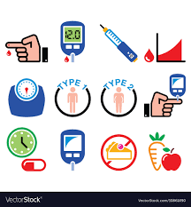

# Diabete Disease Prediction

# Table of Contents
- [Business Problem](#1)
- [Dataset story](#2)
- [Data Content](#3)

## Business Problem :
*It is desired to develop a machine learning model that can predict whether people have diabetes when their characteristics are specified.*

## Dataset Story
- The dataset is part of the large dataset held at the National Institutes of Diabetes-Digestive-Kidney Diseases in the USA. Data used for diabetes research on Pima Indian women aged 21 and over living in Phoenix, the 5th largest city of the State of Arizona in the USA. The target variable is specified as "outcome"; 1 indicates positive diabetes test result, 0 indicates negative.

- Number of variables: 9, Number of observation : 768

## Data Content
- Pregnancies: Number of pregnancies
- Glucose : 2-hour plasma glucose concentration in the oral glucose tolerance test
- Blood Pressure : Blood Pressure (minor blood pressure) (mm Hg)
- SkinThickness : Skin Thickness
- Insulin: 2-hour serum insulin (mu U/ml)
- DiabetesPedigreeFunction : Function (2-hour plasma glucose concentration in oral glucose tolerance test)
- BMI : Body mass index
- Age : Age (years)
- Outcome : Have the disease (1) or not (0)
